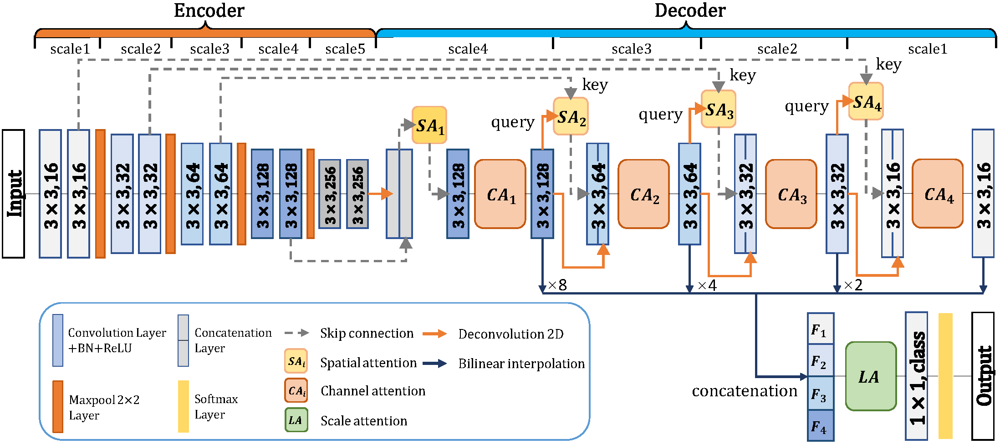
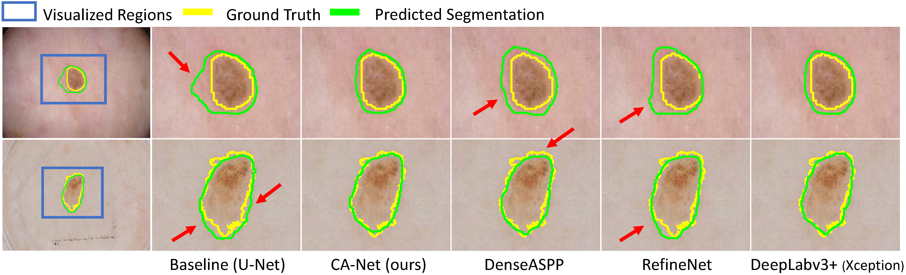
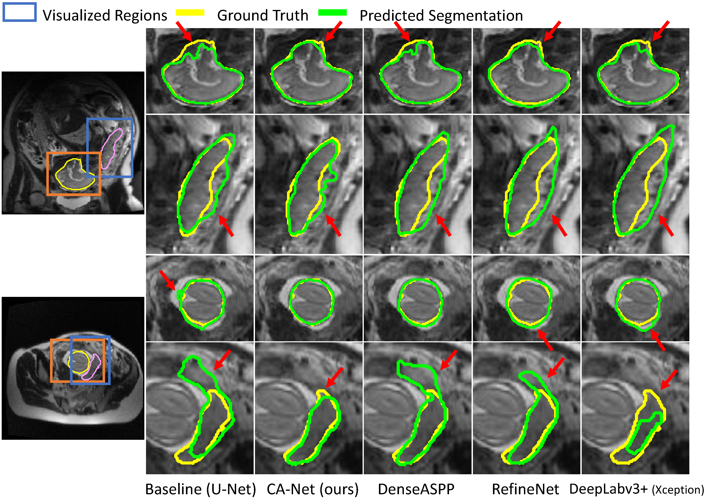
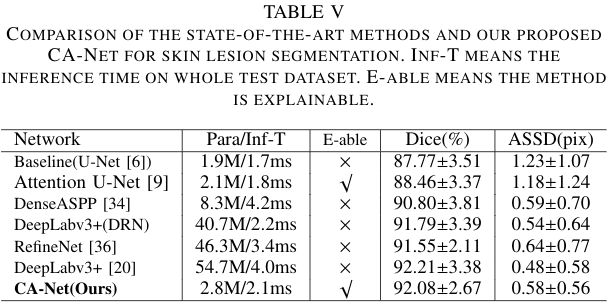
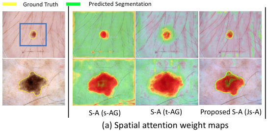
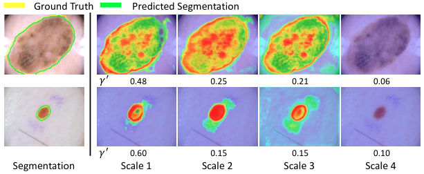

## CA-Net: Comprehensive Attention Convolutional Neural Networks for Explainable Medical Image Segmentation
This repository provides the code for "CA-Net: Comprehensive attention Convolutional Neural Networks for Explainable Medical Image Segmentation". Our work now is available on [Arxiv][paper_link]. Our work is accepted by [TMI][tmi_link].

[paper_link]:https://arxiv.org/pdf/2009.10549.pdf

[tmi_link]:https://ieeexplore.ieee.org/document/9246575


Fig. 1. Structure of CA-Net.


Fig. 2. Skin lesion segmentation.



Fig. 3. Placenta and fetal brain segmentation.

### Requirementss
Some important required packages include:
* [Pytorch][torch_link] version >=0.4.1.
* Visdom
* Python == 3.7 
* Some basic python packages such as Numpy.

Follow official guidance to install [Pytorch][torch_link].

[torch_link]:https://pytorch.org/

## Usages
### For skin lesion segmentation
1. First, you can download the dataset at [ISIC 2018][data_link]. We only used ISIC 2018 task1 training dataset, To preprocess the dataset and save as ".npy", run:

[data_link]:https://challenge.isic-archive.com/data#2018

```
python isic_preprocess.py 
```
2. For conducting 5-fold cross-validation, split the preprocessed data into 5 fold and save their filenames. run:
```
python create_folder.py 
```


2. To train CA-Net in ISIC 2018 (taking 1st-fold validation for example), run:
```
python main.py --data ISIC2018 --val_folder folder1 --id Comp_Atten_Unet
```

3. To evaluate the trained model in ISIC 2018 (we added a test data in folder0, testing the 0th-fold validation for example), run:
```
python validation.py --data ISIC2018 --val_folder folder0 --id Comp_Atten_Unet
```
Our experimental results are shown in the table:


4. You can save the attention weight map in the middle step of the network to '/result' folder. Visualizing the attention weight above the original images, run:
```
python show_fused_heatmap.py
```
Visualzation of spatial attention weight map:


Visualzation of scale attention weight map:

## Citation
If you find our work is helpful for your research, please consider to cite:
```
@article{gu2020net,
  title={CA-Net: Comprehensive Attention Convolutional Neural Networks for Explainable Medical Image Segmentation},
  author={Gu, Ran and Wang, Guotai and Song, Tao and Huang, Rui and Aertsen, Michael and Deprest, Jan and Ourselin, S{\'e}bastien and Vercauteren, Tom and Zhang, Shaoting},
  journal={IEEE Transactions on Medical Imaging},
  year={2020},
  publisher={IEEE}
}
```
## Acknowledgement
Part of the code is revised from [Attention-Gate-Networks][AG].

[AG]:https://github.com/ozan-oktay/Attention-Gated-Networks
